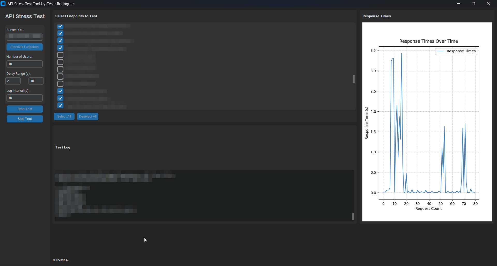

 # 📚 API Stress Tool v1.00 - by César Rodríguez  
 **Herramienta para pruebas de estrés en APIs REST**  

 
   
 ---

 ## 🚀 Instalación Paso a Paso

 ### 1. Descargar el Programa
 - ⬇️ **Opción A**: Clonar repositorio (recomendado para desarrolladores):
    ```bash
   git clone https://github.com/cr7guez/api_stress_tool.git
   cd api_stress_tool-main
    ```
 - ⬇️ **Opción B**: [Descargar ZIP](https://github.com/cr7guez/api_stress_tool/archive/refs/heads/main.zip) y extraer en tu carpeta preferida.

 ### 2. Instalar Python
 - 🐍 **Windows**:
   - Descargar instalador oficial de [python.org](https://www.python.org/downloads/)
   - **IMPORTANTE**: Marcar ✅ *"Add Python to PATH"* durante la instalación

 - 🍏 **Mac/Linux**:
    ```bash
   # Mac (con Homebrew)
   brew install python
 
   # Linux (Debian/Ubuntu)
   sudo apt update && sudo apt install python3 python3-pip
    ```

 ### 3. Instalar Librerías Requeridas
 Ejecutar en terminal (desde la carpeta del proyecto):
  ```bash
 pip install customtkinter matplotlib requests numpy
  ```

 ### 4. Ejecutar la Aplicación
 - 🖱️ **Método fácil**: Hacer doble clic en:
    ```
   api_stress_tool_v1_cr7guez  (Windows)
    ```
   o desde terminal:
    ```bash
   python src/stress_test_tool.py
    ```

 ---

 ## 🖥️ Guía de Uso de la Interfaz

 ### 🔌 Configuración Inicial
 | Campo | Descripción | Valor Recomendado |
 |-------|-------------|-------------------|
 | **Server URL** | URL base de tu API | `http://localhost:5000` |
 | **Discover Endpoints** | Botón para detectar endpoints automáticamente | *(Click después de ingresar URL)* |

 ### ⚙️ Parámetros de Prueba
 | Parámetro | Función | Valor Típico |
 |-----------|---------|--------------|
 | **Number of Users** | Usuarios virtuales simultáneos | `50-200` |
 | **Delay Range (s)** | Intervalo entre peticiones | `0.1 - 5.0` |
 | **Log Interval (s)** | Frecuencia de reportes | `10-30` |

 ### 📊 Selección de Endpoints
 1. Usa el botón **"Discover Endpoints"** para cargar rutas disponibles
 2. Selecciona endpoints individualmente o:
    - ✅ **Select All**: Prueba todas las rutas
    - ❌ **Deselect All**: Limpiar selección

 ### 🎯 Controles Principales
 | Botón | Función |
 |-------|---------|
 | ▶ **Start Test** | Inicia la prueba de estrés |
 | ⏹ **Stop Test** | Detiene la ejecución |
 | ESC | Salir de pantalla completa |

 ---

 ## 📈 Interpretación de Resultados

 ### **Gráfico en Tiempo Real**
 - Muestra los tiempos de respuesta por petición
 - Línea roja: Umbral de alerta (configurable)

 ### **Log de Consola**
  ```log
 === Status Update ===
 Requests: 1250
 Avg Time: 0.45 s | Min: 0.12 s | Max: 2.31 s
 Status Codes: {200: 1180, 500: 70}
 Errors: 3
  ```

 ---

 ## 🛠️ Solución de Problemas

 ### 🔍 Errores Comunes
 | Error | Solución |
 |-------|----------|
 | `Python not found` | Verificar instalación y PATH |
 | `Missing dependencies` | Ejecutar `pip install -r requirements.txt` |
 | `Connection refused` | Verificar URL y que el API esté activa |

 ### 📂 Estructura del Proyecto
  ```
 stress_test_tool/
 ├── src/
 │   ├── stress_test_tool.py      # Código principal
 │   └── assets/                  # Iconos/imágenes
 └── stress_test_tool_v1_cr7guez.bat  # Lanzador Windows
  ```

 ---

 ## 💡 Consejos Profesionales
 1. **Pruebas Iniciales**: Comienza con 10-50 usuarios para calibrar
 2. **Monitoreo**: Usa herramientas como Postman para verificar el API durante las pruebas
 3. **Seguridad**: No ejecutes pruebas en producción sin autorización

 ---
